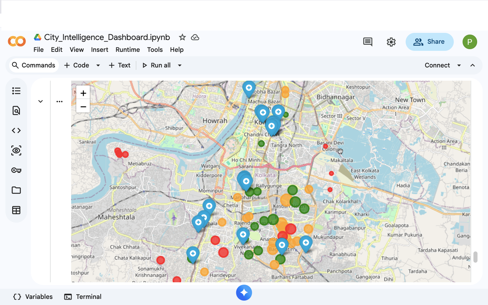

# 🌍 City Intelligence Dashboard

## 📌 Overview
This project analyzes urban infrastructure using geospatial data to evaluate healthcare accessibility and identify underserved areas in a city.

Built using OpenStreetMap data, the system computes distance-based accessibility metrics and visualizes them on an interactive map.

---

## 🎯 Problem Statement
Cities often have uneven distribution of critical services like hospitals.  
This project aims to answer:

- How accessible are hospitals across the city?
- Which areas are underserved?
- Where should new infrastructure be prioritized?

---

## 🧠 Approach

### 1. Data Collection
- Extracted road network and hospital data using OpenStreetMap

### 2. Accessibility Analysis
- Sampled locations across the city
- Computed distance to nearest hospital
- Defined threshold: 1000 meters

### 3. Congestion Proxy
- Estimated road density using spatial clustering
- Used as a proxy for traffic intensity

### 4. Visualization
- Built interactive maps using Folium
- Color-coded accessibility and density

---

## 📊 Key Insights

- ~28% of sampled locations have poor hospital access (>1 km)
- Some areas have distances exceeding **2.5 km**
- Identified high-priority underserved zones

---

## 🗺️ Example Output

- Green → Good access  
- Orange → Moderate access  
- Red → Poor access  

Marker size represents congestion (road density)

---

## 🛠️ Tech Stack

- Python
- GeoPandas
- OSMnx
- Folium
- Scikit-learn
- SciPy

---

## 🚀 How to Run

1. Open the notebook in Google Colab
2. Install dependencies:
   ```bash
   pip install osmnx geopandas folium geopy scipy
